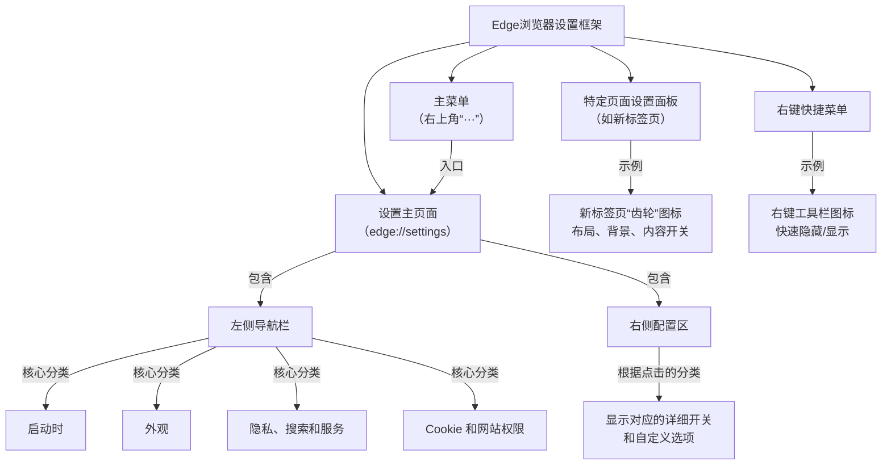

Edge浏览器的“设置”体系是一个**由全局菜单、侧边栏分类、二级详情页和右键快捷操作共同构成的多层结构**。简单来说，它的核心控制中心是独立的“设置”页面，而像新标签页这样的特定界面则拥有自己专属的快速设置面板。

为了让你看得更清楚，我把这个框架梳理成了下面这张图：

接下来，我们就顺着这张图，详细拆解每一个“按钮”和“选项”具体是做什么的。

---

### 🧭 第一层：主菜单与设置入口

主菜单是调整浏览器的“总大门”，它悬浮在浏览器之上，不专属任何网页。

*   **位置与样子**：浏览器右上角，一个由三个水平点组成的“···”图标，鼠标悬停时会显示“设置及其他”。
*   **内容**：
    *   **高频操作**：新建标签页、新建窗口、隐私窗口、历史记录、下载、收藏夹等。
    *   **扩展管理**：快速管理已安装的浏览器插件。
    *   **进入“设置”**：页面中显眼的“设置”选项（带齿轮图标），点击后进入真正的控制中心。
*   **快速操作**：你也可以直接按键盘上的 `Alt+F` 键，效果和点击菜单一样。

---

### ⚙️ 第二层：设置主页面（真正的控制中心）

这是浏览器调整的“大脑”，一个独立的全功能配置页面。你可以通过主菜单进入，或者直接在地址栏输入 `edge://settings`。

这个页面是**“左侧导航栏 + 右侧配置区”**的经典布局。

#### 左侧导航栏：功能分类目录

点击任意一项，右侧就会立刻切换成对应的设置。常见的重要分类有：

| 分类 | 它管什么 | 关键点 |
| :--- | :--- | :--- |
| **启动时** | 浏览器刚打开时显示什么页面 | 可设为“新标签页”、“继续上次浏览”或“打开一个或多个特定网页”。 |
| **外观** | 浏览器的“皮肤”和工具栏上的快捷按钮  | 控制主题、缩放、是否显示“主页”按钮、“收藏夹”按钮、垂直标签页等。 |
| **隐私、搜索和服务** | 你最关心的隐私、安全和搜索 | **清除浏览数据**、防跟踪、地址栏默认搜索引擎、安全DNS等核心功能都在这里。 |
| **Cookie 和网站权限** | 网站能对你做什么 | 管理摄像头、麦克风、位置、弹窗、自动播放等对所有网站的权限。 |
| **系统和性能** | 让Edge运行更顺畅 | 开启或关闭“启动加速”和“在标签页休眠以节省资源”等功能。 |
| **重置设置** | “后悔药”按钮 | 将浏览器恢复到最初状态，用于解决难以排查的问题。 |

#### 右侧配置区：具体的开关和选项

这里会根据你点击的左侧分类，显示对应的详细控制项。它们大多是开关按钮、下拉菜单或可填写的网址框。

---

### 🎨 第三层：特定页面的专属设置面板

除了全局设置，Edge还允许你直接在一些页面上进行“局部”调整，最常见的就是**新标签页**。

*   **在哪里**：打开一个新标签页，看右上角，有一个**小齿轮图标**。
*   **它控制什么**：
    *   **布局**：几套现成的方案。**“聚焦”**模式最简洁，没有新闻资讯；“**启示**”模式突出背景图片；“**信息性**”模式则会展示丰富的新闻资讯。
    *   **背景**：可以换成每日一图、自己的图片，或者纯色。
    *   **快速链接**：决定是否显示页面上的网站快捷方式图标，也就是那些小方块。
    *   **内容**：直接控制整个微软资讯（Microsoft Start）信息流的开关和显示方式。

> 这些调整**不需要点保存**，开关拨动后，页面效果会实时变化。

---

### ⚡ 第四层：快捷操作与右键菜单

这是最快的微调方式，不离开当前页面就能完成操作。

*   **右键工具栏**：在工具栏的**任意按钮**（比如扩展图标、收藏夹图标）上直接右键，大部分都能看到一个直接隐藏或移除它的选项。
*   **右键新标签页**：在页面空白处右键，可以快速进入“壁纸”相关的详细设置。

### 💎 总结一下怎么看这个框架

Edge的设置是一个清晰的“金字塔”结构。你可以根据想做的事情，快速找到对应的位置：

*   **深层、全局的定制**：“主页”按钮要不要？启动时打开什么网站？隐私怎么控制？👉 去 **设置页面（第二层）**。
*   **快速美化入口**：新标签页想显示什么内容、背景用什么图？👉 直接操作 **新标签页本身的齿轮面板（第三层）**。
*   **日常高频微调**：不想看到某个工具栏图标？👉 **右键菜单（第四层）** 最快。

希望这个框架能帮你理清思路，更灵活地驾驭你的浏览器。

